# Using Google Cloud Identity-Aware Proxy with Compute Engine

## Introduction

Google Cloud's [Identity-Aware Proxy](https://cloud.google.com/iap) ("IAP") service enables you to control access to your cloud-based and on-premises applications.  You can use IAP to protect web resources such as Google Compute Engine ("GCE") instances running web applications and Google App Engine ("GAE").  Users browsing protected resources must authenticate to gain access.  You can also use [IAP TCP forwarding](https://cloud.google.com/iap/docs/using-tcp-forwarding) to protect TCP resources such as SSH.
Users attempting to open TCP sessions must also first authenticate before being granted access.  You can use both of these capabilities together.  For example, you may want to restrict access to a web application and also limit SSH access to the web server.

In this demonstration, you will learn how IAP works with both the web and TCP flows.  You will build an environment by running a series of Terraform deployments.
After you build the environment, you will test both the web and TCP flows.  You will then examine the configurations of the resources using the Google Cloud console to get a better understanding of how to configure IAP.

## Architecture overview

Here's a diagram of what you will build.


<p align="Center">Figure 1 - Identity-Aware Proxy demo architecture</p>

Figure 1 shows a web environment with an HTTPS Global Load Balancer frontend and  an unmanaged instance group with a Compute Engine instance as the backend..
The instance runs the Ubuntu operating system and uses Apache to provide web services.
The instance uses [Cloud NAT](https://cloud.google.com/nat/docs/overview) for outbound internet access in order to download packages and updates. 
The instance has no external IP address to support access from the internet.
All inbound access, both for web (HTTPS) and ssh (TCP)  will be provided by IAP.

The left section of Figure 1 shows the IAP TCP flow.  A user wanting to SSH into the back end instance clicks the SSH but on the Compute Engine console or uses "gcloud compute ssh --tunel-through-IAP" to begin the session.
IAP then prompts the user for an identity.
If the identity has the "IAP-secured Tunnel User" role, an encrypted tunnel is created between the console or the gcloud client to the Google endpoint tunnel.cloudproxy.app.  After the tunnel is created, SSH then begins an encrypted session through the encrypted tunnel to the instance providing two layers of encryption.

The right portion of Figure 1 shows the HTTPS flow.
A user browses to a URL secured with an SSL/TLS certificate that points to the IP address of a forwarding rule on the HTTPS Global Load Balancer.
The forwarding rule points to a backend protected by IAP.
IAP prompts the user for an identity.
If the identity has the "IAP-secured Web App User" role, the session passes to the backend web server.

## Prerequisites

1. You will the project ID of a new Google Cloud project linked to a billing account.  You should use a new project to avoid intering with other workloads.  IAP branding, which is used in this demonstration, can only be deleted by deleting the GCP project.

2. You will need a workstation with [Terraform](https://learn.hashicorp.com/tutorials/terraform/install-cli) and the [Google Cloud SDK](https://cloud.google.com/sdk/docs/install).  Here are the versions used to create this demo:

    - Terraform: v1.1.7
    - Google Cloud SDK: 379.0.0

   You can use newer versions of these tools but older versions may not include all of the features used in this demo.  Add the terraform and gcloud programs to your command search path.

3. You will need a fully qualified DNS hostname and the ability to update its IP address (the "A" record)..

4. You will need an SSL certificate and private key associated with the DNS hostname.  These files should be accessible from your workstation.  The files must be in PEM format.

5. You will need a user ID in the Google Cloud project that has accepted the Google Cloud Terms of Service.  The user must have the following IAM roles:

    - Compute Admin (for setting up the network, instance, and load balancer)
    - IAP Polcy Admin (for setting up the Identity Aware Proxy)
    - Logging Admin (for managing logs)
    - OAuth Config Editor (for updating the OAuth information)
    - Service Usage Consumer (for allowing Terraform to use a project for billing and quota purposes)

    User IDs in Google Cloud are in the form of email addresses.
    This user ID will also become part of the OAuth and IAP configurations.
The email address must belong to the currently logged in user account.

6. There must not be any organization constraints that restrict the ability to deploy the services.  You can change these settings in the Google Cloud console under IAM & Admin > Organization Policies at the project level.  Examples of such constraints include (but are not limited to):

    - The policy "Restrict Load Balancer Creation Based on Load Balancer Types" must allow the EXTERNAL_HTTP_HTTPS load balancer (the classic Global Load Balancer) type.

7. You should be familiar with using the Google Cloud console and Terraform.

8. There are minor charges for the resources used, such as an e2.micro Compute Engine instance.  To avoid future charges, follow the cleanup instructions.


## Build instructions

### Configure authentication

1. Launch a terminal session.

2. Sign on to your Google Cloud account as the user for the Google Cloud project using the command below.

    ```
    gcloud auth login
    ```

    In addition to the user ID and password, you may also be asked to grant access to the Google Cloud SDK.  See Figure 2 for more details.


    | Enter user | Enter password | Grant access |
    | :-: | :-: | :-: |
    | 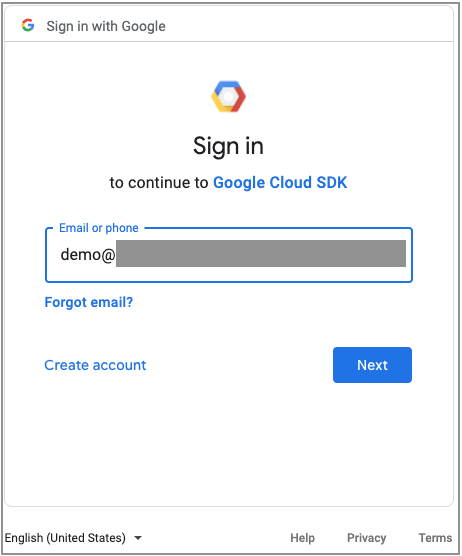 | 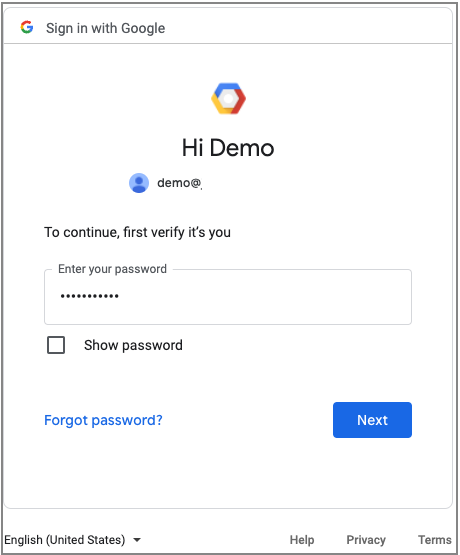 |  |

    <p align="Center">Figure 2 - Google SDK sign in process</p>


2. Set your default project ID using the command below, using your project ID in place of *INSERT-PROJECT-ID-HERE*.

   ```
   gcloud config set project *INSERT-PROJECT-ID-HERE*
   ```

3. Set your application default credentials so Terraform has credentials to run.

    ```
    gcloud auth application-default login 
    ```
    You may be prompted for a user ID and password and also to grant access to the Google Auth Library as shown in Figure 3.
    | Enter user | Grant access |
    | :-: | :-: |
    |  | 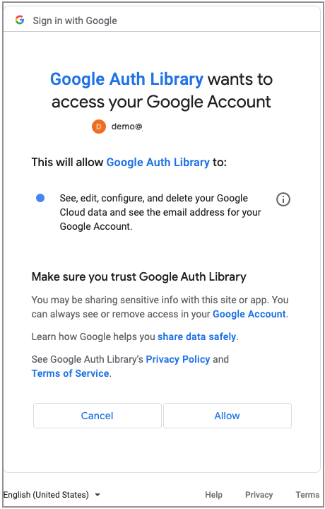 |

### Download the demo repository

1. Clone this repository to your workstation.

    ```
    git clone https://github.com/jeffscottlevine/iap-demo.git
   ```

2. Change your working directory to the newly-cloned repository.

    ```
    cd iap-demo
    ```

3. Set the environment variable to the current directory for easy navigation.

    ```
    export DEMOHOME=`pwd`
    ```

4. Here's a diagram of the repository.

    ```
    .
    ├── LICENSE
    ├── README.md
    ├── img
    │   └── 000-IAP-gce-demo-main.png
    └── modules
        ├── 00-global-variables
        │   └── outputs.tf.example
        ├── 10-enable-apis
        │   ├── main.tf
        │   └── providers.tf
        ├── 20-create-iap-brand
        │   ├── main.tf
        │   └── providers.tf
        └── 90-build-demo
            ├── main.tf
            ├── outputs.tf
            └── providers.tf
    ```

    <div align="Center">Figure 3 - Demo directory structure</div>

    All Terraform modules are in the *modules* directory.  Each module will have its own local Terraform state.  Here's a description of each module.

    - 00-global-variables

        All global variables for the demo are defined here and presented as outputs that are referenced in the other modules

    - 10-enable-apis

        This module enables all of the Google Cloud APIs that are needed for the demo.  Destroying the module clears the state information but does not disable the APIs.

    - 20-create-iap-brand

        This module defines the OAuth brand for IAP.  Only one brand is allowed per Google Cloud project.  The brand cannot be deleted after it is defined. Destroying the module clears the state information but does not delete the brand.

    - 90-build-demo

        This module builds the demo.  The module outputs the IP address of the load balancer frontend forwarding rule.  Destroying this module will free up all Google Cloud resources.

### Deploy the demo

#### Define the global variables

1. Change to the 00-global-variables directory.

    ```
    cd $DEMOHOME/modules/00-global-variables
    ```

2. Create the file outputs.tf from the outputs.tf.example file.

    ```
    cp outputs.tf.example outputs.tf
    ```

3. Using the text editor of your choice, open outputs.tf.  The first part of the file contains required value as shown in Figure 4.  as described below,  Do not delete the quotation marks.

    ```
    # Begin - Required Values

    output "project_id" {
      value = "INSERT-PROJECT-ID-HERE"
    }

    output "ssl_certificate_file" {
      value = "/path/to/certificate"
    }

    output "ssl_private_key_file" {
      value = "/path/to/privatekey"
    }

    output "iap_test_user" {
      value = "testuser@example.com"
    }

    # End - Required Values
    ```

    <div align="Center">Figure 4 - Demo directory structure</div>

4. Edit outputs.tf as described below.

    - Replace *INSERT-PROJECT-ID-HERE* with your Google Cloud project id.

    - Replace */path/to/certificate* with the path to the certificate file in PEM format.  You can use either an absolute or relative path.  The name of the certificate file will vary based on the issuer. Common names of this file are cert.pem or certificate.crt.

    - Replace */path/to/privatekey* with the path to the private key file in PEM format.  You can use either an absolute or relative path.  The name of the private key file  will vary based on the issuer. Common names of this file are privkey.pem or private.key.

    - Replace *testuser<span>@</span>example.com* with your user ID (in email format). This will be used for both the OAuth consent screen and for granting access to SSH and to the web page.

    - (Optional) edit the remaining value to change the region, zone, image project, and image family.  Note: This demo has only been tested for the Ubuntu 20.04 LTS operating system!

5. Save the outputs.tf file and exit the text editor.

6. Use the commands below to build this Terraform module.

    ```
    terraform init
    terraform plan --out=plan.out
    terraform apply plan.out
    ```

    You should see the message "Apply Complete" followed by output values corresponding to the edits in the file.  If any error messages appear, edit the outputs.tf to fix the  errors and repeat the three terraform commands above.

#### Enable the Google Cloud APIs

The demo uses several Google Cloud APIs.  The module named *10-enable-apis* enables these APIs for use in the Google Cloud project. Note that Running *terraform destroy* in this module does not disable the APIs.

1. cd $DEMOHOME/modules/10-enable-apis

2. Use the commands below to build this Terraform module.

    ```
    terraform init
    terraform plan --out=plan.out
    terraform apply plan.out
    ```

3. Upon successful completion, you will see "Apply Complete" followed by a lost of APIs that were enabled.

#### Deploy the OAuth IAP brand

In order to enable IAP, the demo sets up the [OAuth consent screen](https://cloud.google.com/iap/docs/programmatic-oauth-clients).  The consent screen contains branding information.

> **NOTE:** You can only run this module once within a Google Cloud project as Google Cloud only allows one brand per project and it is not possible to delete the OAuth brand information.  If you need to rebuild the demo in the same project, skip this section and proceed to the *Deploy the demo" section below.

1. Change your working directory to the 20-create-iap-brand module.

    ```
    cd $DEMOHOME/modules/20-create-iap-brand
    ```

2. Use the commands below to build this Terraform module.

    ```
    terraform init
    terraform plan --out=plan.out
    terraform apply plan.out
    ```

#### Deploy the demo

1. Change your working directory to the 90-build-demo module.

    ```
    cd $DEMOHOME/modules/90-build-demo
    ```

2. Use the commands below to build this Terraform module.

    ```
    terraform init
    terraform plan --out=plan.out
    terraform apply plan.out
    ```

3. Upon successful completion, you will see "Apply Complete" followed by the IP address of the HTTPS Global Load Balancer.

#### Configure DNS

In order to launch to display the web server home page, you must make a DNS change.

1. Follow the instructions of your DNS provider, create or modify the address record (the "A" record) for the host name to point to the IP address for the load balancer as provided by the previous step.  The host name must be associated with the SSL certificate you supplied.  You should use a low time-to-live ("TTL") to make it easier to change the IP address if you rebuild the demo at a later time.

2. Wait for the DNS change to propagate.

### Test the demo

1. To test the web flow, open an incognito/private tab in your brower and browse to the DNS host name that is associated with the SSL certificate and IP address.

2. You will be promped by the Identity-Aware Proxy to authenticate.

3. Upon successful authentication, you will see the web server home page with the web server's instance name, internal IP address, and instance ID as shown in Figure 5.

    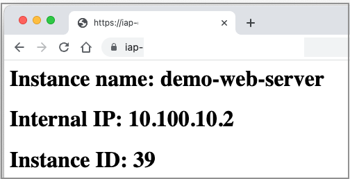
    <p align="Center">Figure 5 - Test of web IAP flow</p>

4. To test the SSH flow, on the Google Cloud console, go to the Compute Engine->VM Instances menu.  Look at the line containing the demo-web-server instance.  Notice that there is no external IP address for the instance.

    To the right of the demo-web-server instance,  click the down arrow next to SSH and then click the *View gcloud command* option as shown in Figure 6.

    
    <p align="Center">Figure 6 - Display options for ssh IAP flow</p>

5. You will see The gcloud command as shown in Figure 7.

    
    <p align="Center">Figure 7 - gcloud command for accessing the instance</p>

    The *gcloud compute ssh* command selects the instance by name, zone, and project.  The command also includes a *--tunnel-through-iap* argument to cause the connection to the instance to be brokered by IAP.

6. Click the *copy-to-clipboard* icon next to the gcloud command and then bring up the Cloud Shell and paste the gcloud command into the Cloud Shell window and press *enter*.

7. You will be asked to provide authentication information.  You may be asked to choose a passphrase.  If so,  make a note of your passphrase in case you need it later.  You will then be taken to an ssh session on the web server instance as shown in Figure 8.

    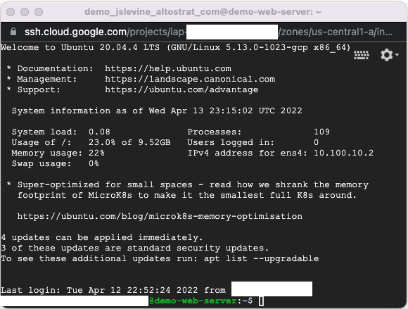
    <p align="Center">Figure 8 - SSH session on web server</p>

    You have successfully completed the testing of the web and SSH flows through the Identity-Aware Proxy.  In both flows, you were asked to authenticate to establish your identity.  After authenticating, you were granted access to the web page and ssh session.

### Behind the scenes

Now that you have built and tested the demo environment, you will now explore some of the underlying services to see how they are configured.  You will first examine the configuration of the load balancer backend and work your way up through the load balancer configuration.  You will then examine the configuration of IAP.

1.  In the Google Cloud console, select Compute Engine -> VM Instances. You will see an instance named *demo-web-server* as shown in Figure 9.

    
    <p align="Center">Figure 9 - Web server instance</p>

    The instance has no external IP address and can therefore not be accessed directly from the internet.  The IAP will broker the external access attempts and provide connections to the instances's internal IP address.

2. Click on the name of the instance (*demo-web-server*).  You will see information about the instance as shown in Figure 10.

    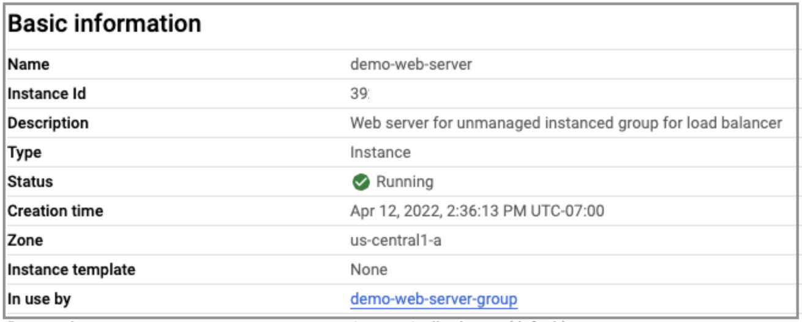
    <p align="Center">Figure 10 - Web server instance information</p>

    You can see the instance ID that was displayed on the server home page. Also, the instance belongs to an instance group named *demo-web-server-group*.

3. Click on the instance group name *demo-web-server-group*.  The instance group appears as shown in Figure 11.

    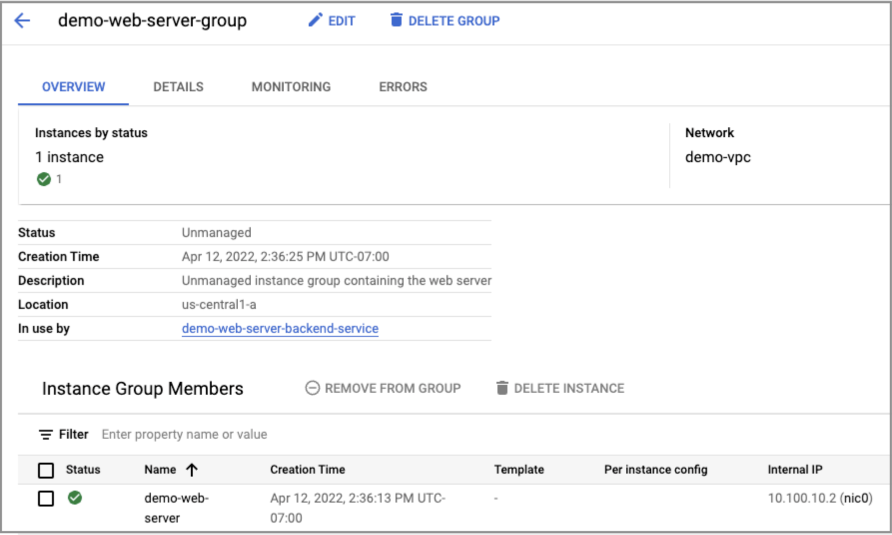
    <p align="Center">Figure 11 - Instance group information</p>

    The instance group is unmanaged and contains only the single web server instance.  The instance group is part of the load balancer backend service named **demo-web-server-backend-service*.

4.  Click on *demo-web-server-backend-service*.  The backend service appears as shown in Figure 12.

    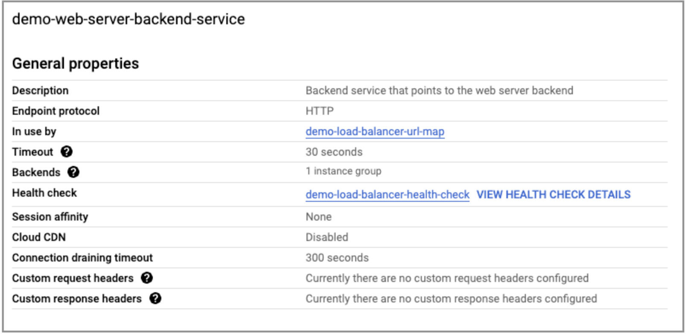
    <p align="Center">Figure 12 - Backend service information</p>

5.  Click on *demo-load-balancer-url-map*.  Figure 13 shows the load balancer URL map which defines the top level of the load balancer configuration.

    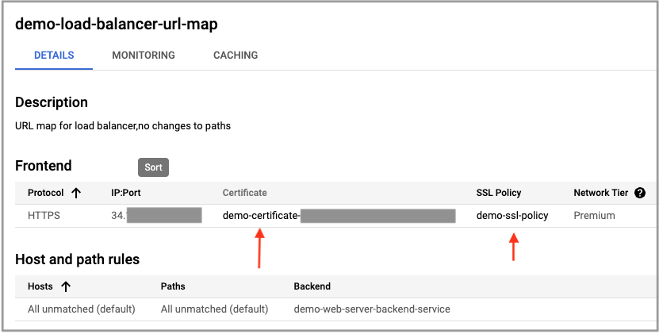
    <p align="Center">Figure 13 - Load balancer URL map</p>

6.  Open the *demo-ssl-policy* link in a new browser tab.  In Figure 14, you can see the SSL policy  has been set to MODERN which limits the ciphers that are accepted and that a minimum of TLS 1.2 is required.

    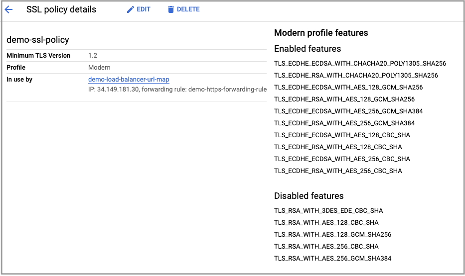
    <p align="Center">Figure 14 - Load balancer SSL policy</p>

7.  Go to the browser tab with the URL map and open *demo-certificate* in a new browser tab.  In Figure 15, you can see the properties of the certificate that you provided.

    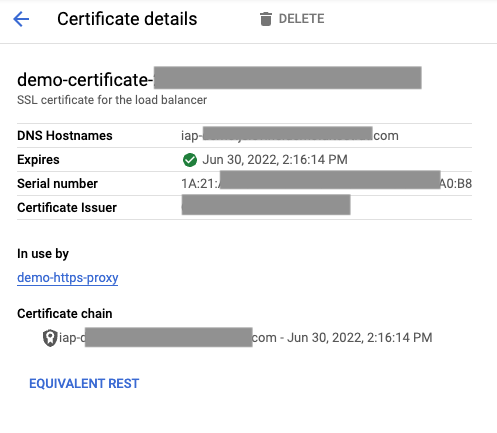
    <p align="Center">Figure 15 - Load balancer SSL certificate</p>


    You have now seen how the load balancer backend service is configured with an instance group that contains a single instance.  You will now look at the configuration of IAP.

8. In the Google Cloud Console menu click Security > Identity-Aware Proxy.

9. As shown in figure 16, do the following:

   - Click *HTTPS RESOURCES*
   - Check the box next to *demo-web-server-backend-service*
   - Open the toggle next to *IAP-secured Web App User*

    
    <p align="Center">Figure 16 - IAP HTTPS configuration</p>

    The line that contains *demo-web-server-backend-service* refers to the backend service that you had seen in a previous step.  The slider is to the right which means that IAP is enabled on that backend service.   Under IAP-secured Web App user, you can see that the name of the test user.  The test user is allowed to access the backend service (which ultimately points to the web server) after successfully authenticating.

10. As shown in figure 17, do the following:

    - Click *SSH AND TCP RESOURCES*
    - Check the box next to *demo-web-server*
    - Open the toggle next to *IAP-secured Tunnel User*


    
    <p align="Center">Figure 17 - IAP SSH configuration</p>

    The line that contains *demo-web-server* refers to the web-server-instance. The slider is to the right which means that IAP is enabled on that instance.   Under IAP-secured Tunnel User, you can see that the name of the test user.  The test user is allowed to ssh to the web server after successfully authenticating.

    You will also see a warning next to demo-web-server.  The reason for this warning is that the firewall rule in the VPC network only allows TCP port 22 for SSH.  You can use IAP TCP forwarding to proxy access to any TCP port.  The warning is saying that you may want to open additional ports on the firewall. Since the firewall rule only needs to allow port 22 for SSH tunneling, you can safely ignore the warning.

    You have now seen how IAP is configure for both the web and TCP flows.  In the next section, you will clean up the demo environment.

### Clean up

Please follow the steps below to remove the demonstration environment.

1. Change your working directory to the 90-build-demo module.

    ```
    cd $DEMOHOME/modules/90-build-demo
    ```

2. Use the command below to destroy the demo environment.

    ```
    terraform destroy
    ```

    Respond with *yes* when asked to confirm that you want to destroy the resources.

3. Upon successful completion, you will see "Destroy complete."  You do not have to destroy any of the other modules.

4. If you want to delete the IAP OAuth branding information and are *not* using the GCP project for anything else, you can delete the GCP project.

## Error messages

The table below lists errors you may encounter when deploying this demo and remediation steps.

| Error | Remediation |
|--|--|
| "UREQ_TOS_NOT_ACCEPTED" | This error arises when deploying the demo with a newly-created user ID.  You must log into the Google Cloud console with this user ID and accept the Google Cloud Terms of Service. |
